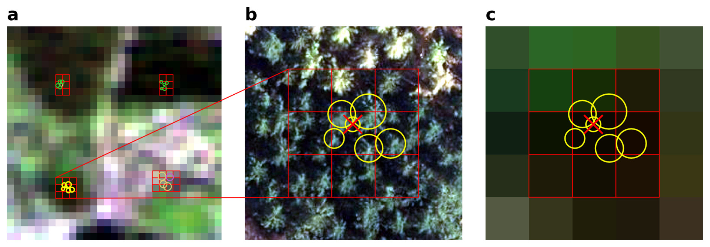

<div align="center">
    
</a>
    <h3 align="center">Tree Species Classification in Germany</h3>
</div>

<details>
<summary>Table of Contents</summary>
<ol>
    <li>
    <a href="#about-the-project">About The Project</a>
    </li>
    <li>
    <a href="#getting-started">Getting Started</a>
    <ul>
        <li><a href="#installation">Installation</a></li>
    </ul>
    </li>
    <li><a href="#usage">Usage</a></li>
    <li><a href="#roadmap">Roadmap</a></li>
    <li><a href="#contact">Contact</a></li>
</ol>
</details>

---

## About The Project

This project was developed as part of the Domain Project 2 in collaboration with a State Forestry Administration in Germany.
The forestry administration is responsible for the sustainable management and maintenance of state forests. A key component of this task is understanding the distribution of tree species, as it serves as the foundation for decisions in forest management, biodiversity conservation, and climate protection.

Traditionally, this information is collected through a large-scale forest inventory (Bundeswaldinventur, BWI), conducted every ten years on a sample grid across Germany. While it provides valuable insights, it does not offer complete spatial coverage of all forested areas.

To achieve a comprehensive classification of tree species across the country, this project leverages Sentinel-2 multispectral satellite imagery. Sentinel-2 offers high-resolution, multispectral time-series data suitable for monitoring large areas.
The main challenge lies in reducing data volume while maintaining model performance, as processing long temporal series for each pixel is computationally expensive.

The goal of this project is to develop robust machine learning methods capable of producing reliable tree species classifications using a minimal number of time steps per pixel.

<p align="right">(<a href="#readme-top">back to top</a>)</p>

---

## Getting Started

Follow the instructions below to set up a local development environment for this project.

### Installation

You can install the project dependencies using either pip or uv:

pip:

```bash
python -m pip install -e .
```

uv:

```bash
uv pip install -e .
```


---

## Roadmap

- [X] Basic Data Analysis
- [X] Advanced Data Analysis & Feature Engineering
- [X] Baseline Model
- [X] Machine Learning Models
  - [X] Preprocessing & Processing
  - [X] LSTM
  - [X] Ensemble Models
  - [X] Training Pipeline
  - [X] Feature Importance
- [X] Data Reduction

---

## Contact

- Evelyn Rempel - reev1011@h-ka.de
- Alexandru Cozma - coal1014@h-ka.de
- Rafael Riesle - rira1011@h-ka.de


