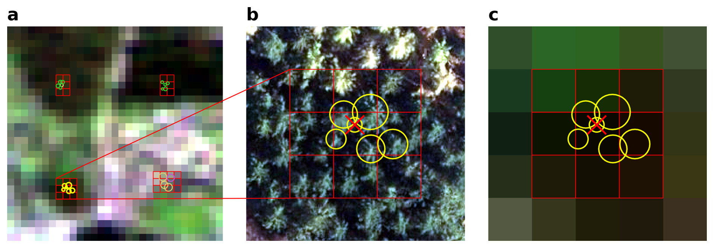

<a id="readme-top"></a>
<br />
<div align="center">
  
  <h3 align="center">Tree Species Classification</h3>
</div>

<details>
  <summary>Table of Contents</summary>
  <ol>
    <li>
      <a href="#ensemble-models">Ensemble Models</a>
      <ul>
        <li><a href="#ensemble-experiments">Ensemble Experiments</a></li>
        <li><a href="#ensemble-evaluation">Ensemble Evaluation</a></li>
        <li><a href="#ensemble-pipeline">Ensemble Pipeline</a></li>
      </ul>
    </li>
    <li>
      <a href="#lstm-model">LSTM Model</a>
      <ul>
        <li><a href="#lstm-experiments">LSTM Experiments</a></li>
        <li><a href="#lstm-evaluation">LSTM Evaluation</a></li>
        <li><a href="#lstm-pipeline">LSTM Pipeline</a></li>
      </ul>
    </li>
  </ol>
</details>

---

## Ensemble Models

### Ensemble Experiments

This section focuses on training **ensemble-based machine learning models** such as **XGBoost** and **Random Forest** with different hyperparameter configurations.  
Hyperparameters can be defined via **Grid Search**, allowing systematic experimentation and optimization.

Example setup:

```python
def define_models():
    return [
        (
            RandomForestClassifier,
            {"n_estimators": [2], "max_depth": [15], "min_samples_split": [5]},
        ),
        (
            xgb.XGBClassifier,
            {
                "n_estimators": [10],
                "learning_rate": [0.01],
                "max_depth": [10],
            },
        ),
    ]
```


Each model is trained on preprocessed Sentinel-2 time series data to classify tree species based on spectral and temporal features.

### Ensemlbe Evaluation
The best-performing model from the grid search is evaluated in detail.
Evaluation includes:

- Calculation of standard classification metrics (accuracy, precision, recall, F1-score).

- Visualization of the confusion matrix to assess class performance.

- Analysis of feature importance to identify the most relevant spectral indices and temporal features.

### Ensemlbe Pipeline
The full ensemble model pipeline includes:
- Loading and preparing data
- Model training using the selected algorithm
- Evaluation on the validation dataset

Run the pipeline using:
```bash
python run_ensemble_pipeline.py
```

<p align="right">(<a href="#readme-top">back to top</a>)</p>

---


## LSTM Model

### LSTM Experiments

The LSTM (Long Short-Term Memory) model is trained to capture temporal dependencies in Sentinel-2 time series data.
During experimentation, key parameters such as number of epochs, batch size, and sequence length are tuned to optimize performance.

### LSTM Evaluation

The trained LSTM model is evaluated on the validation set using:
- Classification accuracy and loss curves
- Comparison of predicted vs. true species labels
- Optional analysis of feature importance derived from time-step contributions (e.g., via attention or perturbation analysis)

This helps understand which time periods and spectral bands are most relevant for accurate classification.

### LSTM Pipeline

The LSTM training pipeline automates the workflow:
- Load preprocessed time series data
- Train the LSTM model with specified hyperparameters
- Evaluate performance on the validation dataset
Run the pipeline using:
```bash
python run_lstm_pipeline.py
```


<p align="right">(<a href="#readme-top">back to top</a>)</p>

---